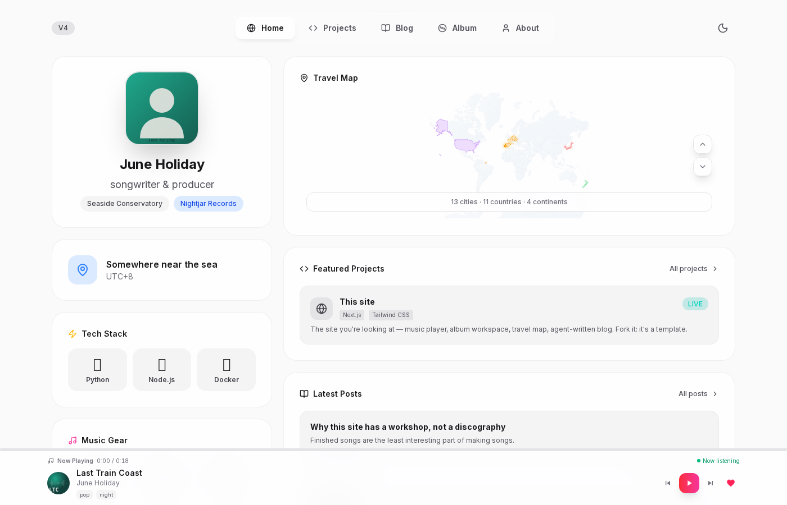
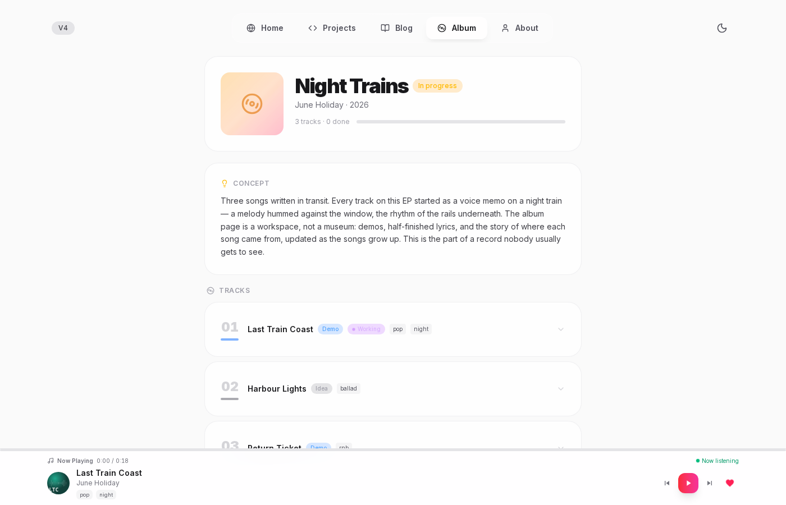

# liner-notes

[](LICENSE)

**A personal-site template for musicians** — music player, album *workshop* (not a discography: demos, half-finished lyrics, and the story of each song while it's still growing), travel map, blog with an optional agent-written daily pipeline, and a small admin panel. Next.js App Router + Tailwind.

Extracted from my own site, which has run this code in production since early 2026. Everything personal lives in a handful of JSON files; everything else is yours to keep or delete.



The album workshop, mid-song:



## What's in the box

| Tab | What it does |
|---|---|
| **Home** | avatar, badges, timeline, tech & instrument stacks, projects — all from `content/` |
| **Album** | the workshop: per-track status (`Idea → Demo → Done`), inline demo player, writing notes, the story behind each song |
| **Music** | a persistent bottom player with playlist, covers, and tags — keeps playing across tabs |
| **Travel** | an interactive world map of everywhere the songs were written |
| **Blog** | markdown posts from `posts/`; AI-written posts are labeled `aiGenerated` — readers deserve to know |
| **/admin** | edit home/album/projects JSON from the browser (password via `ADMIN_PASSWORD` env) |

## Make it yours

```bash
git clone https://github.com/hycccc/liner-notes && cd liner-notes
npm install && npm run dev
```

Then edit, in order of impact:

1. **`content/site.json`** — your name, tagline, badges, location, socials. This single file drives the header, the about tab, and all metadata.
2. **`content/home.json` / `content/album.json` / `content/projects.json`** — timeline, the album workshop, project cards.
3. **`public/music/` + `data/index.tsx`** — replace the three synthesized demo tracks with your own audio (the shipped ones are CC0 placeholder synths, so the template carries zero rights questions).
4. **`components/SimpleTravelMap.tsx`** — the `locations` array is your travel history.
5. **`posts/`** — your writing, as markdown with frontmatter.

## Optional machinery

- **`scripts/sync-playlist.js`** — keeps the player in sync with a streaming-service playlist via a self-hosted API instance (bring your own; no credentials ship in this repo).
- **`skills/auto-blog/`** — an agent skill that fetches trending topics and drafts daily posts through whatever LLM CLI you point it at. Posts land in `posts/` stamped `aiGenerated: true`.
- **`scripts/deploy.sh`** — SSH-key deploy driven by `DEPLOY_HOST` / `DEPLOY_PATH` env vars. This script takes no passwords, ever.

## Design notes

- The album page is a **workshop, not a museum** — showing unfinished work is the feature, not a compromise.
- The demo persona (June Holiday, of Nightjar Records) is fictional and shared with my other projects; every asset under `public/` is synthesized or hand-drawn SVG, so a fork starts from a legally clean slate.
- The admin panel writes the same JSON files you'd edit by hand — no database, no CMS, rsync-able.

## License

MIT
